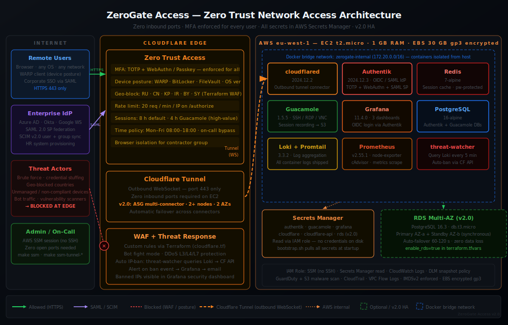
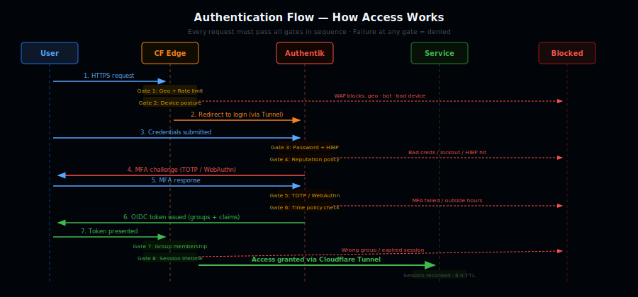

<div align="center">



<br/>

# ZeroGate Access

**Self-hosted Zero Trust Network Access — no VPN, no open ports, no compromise.**

<br/>

[](https://terraform.io)
[](https://www.cloudflare.com/products/tunnel/)
[](https://goauthentik.io)
[](https://guacamole.apache.org)
[](https://grafana.com)

[](https://docker.com)
[](https://aws.amazon.com)
[](LICENSE)
[](.github/workflows/ci.yml)

<br/>

> *Every request authenticated · Every action logged · Zero ports exposed · No exceptions*

<br/>

[What is it?](#what-is-zerogate-access) · [Quick Start](#quick-start) · [Architecture](#architecture) · [Auth Flow](#authentication-flow) · [Service Map](#service-map) · [Deployment](#deployment-phases) · [Operations](#operations) · [Security](#security) · [Roadmap](#roadmap)

</div>

---

## What is ZeroGate Access?

ZeroGate Access is a self-hosted Zero Trust Network Access (ZTNA) platform. It gives your team secure, browser-based access to internal resources — without opening a single port on your server, without installing VPN clients on user devices, and without trusting the network.

It combines **Cloudflare Tunnel + Authentik IdP + Apache Guacamole + full observability** in one Docker Compose stack on a single EC2 instance, provisioned entirely by Terraform.

### The problem it solves

| Problem | Typical approach | ZeroGate Access |
|---|---|---|
| Secure remote access | VPN client on every device | Browser-based, no client needed |
| Server exposed to internet | Open ports, firewall rules | Zero inbound ports — nothing to scan |
| MFA enforcement | Optional, per-app | Mandatory for every user, every time |
| Who accessed what? | Application logs (if any) | Unified audit log in Grafana |
| Secret management | `.env` in git / hardcoded | AWS Secrets Manager, auto-populated |
| Management without SSH | Bastion host, open port 22 | AWS SSM — zero ports, full shell |
| Emergency access | Hope you kept the key | `make ssm` — always works |

### What this is NOT

- Not a traditional VPN — no network-level access
- Not a reverse proxy with open ports — no inbound listeners whatsoever
- Not a SaaS product — 100% self-hosted, your infrastructure, your data
- Not a jump box — no SSH tunnels, no bastion host

---

## Quick Start

**Requirements:** AWS account, Cloudflare account (free), domain on Cloudflare nameservers, Terraform ≥ 1.7, AWS CLI v2, Docker Compose v2.

```bash
# 1. Clone
git clone https://github.com/yourorg/zerogate
cd zerogate

# 2. Configure AWS credentials
aws configure

# 3. Initialize and deploy infrastructure
make init
make plan    # Review: confirm IpPermissions: [] on security group
make apply

# 4. Connect to EC2 (no SSH — via AWS SSM)
make ssm

# 5. Bootstrap the instance
sudo ./scripts/bootstrap.sh

# 6. Initialize Guacamole database schema (run once)
make guac-init

# 7. Configure Cloudflare Tunnel (on EC2)
cp docker/cloudflared/config.yml.example docker/cloudflared/config.yml
# Edit: fill YOUR_TUNNEL_ID and YOUR_DOMAIN

# 8. Start everything
make up

# 9. Verify
make health
make audit
```

> After `make up`, access Authentik initial setup via SSM tunnel:
> `make ssm-tunnel-9000` → open http://localhost:9000/if/flow/initial-setup/

---

## Architecture


Three zones, one invariant: **no inbound ports on the EC2 instance**. All traffic arrives at Cloudflare's edge and travels inward via an outbound-initiated WebSocket tunnel — there is nothing on the EC2 to scan or attack from the internet.

### Zero-Port Guarantee

```
AWS Security Group — aws_security_group.main (infrastructure/ec2.tf)
  Inbound rules:   NONE
  Outbound rules:  ALL (cloudflared reaches Cloudflare edge on 443)

OS-level — UFW (scripts/bootstrap.sh)
  default deny incoming
  default allow outgoing

Verify any time:
  aws ec2 describe-security-groups \
    --group-ids $(cd infrastructure && terraform output -raw security_group_id) \
    --query 'SecurityGroups[0].IpPermissions'
  # Expected: []
```

---

## Authentication Flow



Every request passes **8 sequential gates** — failure at any gate denies access immediately. Gates 1–2 run at the Cloudflare edge before traffic ever reaches AWS. Gates 3–6 run inside Authentik. Gates 7–8 run at Cloudflare Access on the return path.

---

## Service Map

The full dependency graph of services running inside Docker on the EC2 instance.

```
                     ┌─────────────────────────────────────────────────────────┐
                     │             CLOUDFLARE EDGE (external)                  │
                     └─────────────────────┬───────────────────────────────────┘
                                           │ encrypted WebSocket (outbound from EC2)
                                           ▼
┌──────────────────────────────────────────────────────────────────────────────────┐
│  Docker network: zerogate-internal  172.20.0.0/16                               │
│                                                                                  │
│  ┌──────────────────────────────────────────────────────────────────────────┐   │
│  │  TUNNEL LAYER                                                            │   │
│  │                                                                          │   │
│  │  cloudflared:2024.12.2                                                   │   │
│  │  Depends on: authentik-server (healthy) · guacamole (healthy)           │   │
│  │              grafana (healthy)                                            │   │
│  │  Routes:  auth.*    → authentik-server:9000                              │   │
│  │           access.*  → guacamole:8080                                     │   │
│  │           monitor.* → grafana:3000                                       │   │
│  └──────────────────────────────────────────────────────────────────────────┘   │
│                                                                                  │
│  ┌──────────────────────────────┐   ┌───────────────────────────────────────┐   │
│  │  IDENTITY LAYER              │   │  ACCESS LAYER                         │   │
│  │                              │   │                                       │   │
│  │  authentik-server:9000       │   │  guacamole:8080                       │   │
│  │  authentik-worker            │   │  OIDC ← authentik-server              │   │
│  │  (shared env/volumes)        │   │  Depends on: guacd · guacamole-db    │   │
│  │                              │   │                                       │   │
│  │  Depends on:                 │   │  guacd:4822                           │   │
│  │  ┌────────────────────────┐  │   │  (native RDP/SSH/VNC proxy daemon)   │   │
│  │  │ authentik-db           │  │   │                                       │   │
│  │  │ postgres:16-alpine     │  │   │  guacamole-db                         │   │
│  │  │ 512m limit             │  │   │  postgres:16-alpine                   │   │
│  │  └────────────────────────┘  │   │  256m limit                           │   │
│  │  ┌────────────────────────┐  │   └───────────────────────────────────────┘   │
│  │  │ authentik-redis        │  │                                               │
│  │  │ redis:7-alpine         │  │                                               │
│  │  │ 256m limit             │  │                                               │
│  │  └────────────────────────┘  │                                               │
│  └──────────────────────────────┘                                               │
│                                                                                  │
│  ┌──────────────────────────────────────────────────────────────────────────┐   │
│  │  OBSERVABILITY LAYER                                                     │   │
│  │                                                                          │   │
│  │  grafana:11.4.0          loki:3.3.2            prometheus:v2.55.1        │   │
│  │  OIDC ← authentik        Receives from:        Scrapes:                  │   │
│  │  Reads: loki             promtail:3.3.2         node-exporter:v1.8.2    │   │
│  │         prometheus        (Docker log shipper)   cadvisor:v0.49.1        │   │
│  │                                                                          │   │
│  │  Retention: Prometheus 30d / 5GB                                        │   │
│  │  Dashboards: access-logs · security-events · system                     │   │
│  └──────────────────────────────────────────────────────────────────────────┘   │
│                                                                                  │
│  ┌──────────────────────────────────────────────────────────────────────────┐   │
│  │  THREAT RESPONSE LAYER (v1.1)                                            │   │
│  │                                                                          │   │
│  │  threat-watcher (curl-jq:alpine · 64m)                                  │   │
│  │  Loop every 5m:                                                          │   │
│  │    1. Query Loki → {service="authentik-server"} |= "login_failed"       │   │
│  │    2. Extract source IPs from log lines                                  │   │
│  │    3. Count failures per IP in last WINDOW_MINUTES                       │   │
│  │    4. IPs ≥ BAN_THRESHOLD → POST Cloudflare Firewall API → block        │   │
│  └──────────────────────────────────────────────────────────────────────────┘   │
└──────────────────────────────────────────────────────────────────────────────────┘
```

### Authentication Flow Detail

```
User Browser
    │
    │ 1. GET auth.yourdomain.com
    ▼
Cloudflare Access
    │ 2. Not authenticated → redirect to Authentik
    ▼
Authentik (authentik-server:9000)
    │
    ├─── Stage 1: Identification (username lookup)
    │         └── authentik-db (PostgreSQL) — user record
    │
    ├─── Stage 2: Password (hash check)
    │
    ├─── Stage 3: TOTP Validation (mandatory — blocks without MFA)
    │         └── ReputationPolicy: lockout after 5 failed attempts
    │
    ├─── Password Policy: min 14 chars · uppercase · lowercase · digits · symbols
    │                     HaveIBeenPwned check (0 allowed breaches)
    │
    └─── OIDC token issued → Cloudflare Access validates → session granted
```

### Secrets Flow

```
Terraform (infrastructure/)
    │
    │ terraform apply
    ▼
AWS Secrets Manager
    ├── zerogate-production/authentik  → AUTHENTIK_SECRET_KEY, DB_PASSWORD, REDIS_PASSWORD
    ├── zerogate-production/guacamole  → GUACAMOLE_DB_PASSWORD
    ├── zerogate-production/grafana    → GRAFANA_ADMIN_PASSWORD, GRAFANA_SECRET_KEY
    └── zerogate-production/cloudflare → CF_TUNNEL_TOKEN (set manually after tunnel creation)
         │
         │ bootstrap.sh pulls via IAM role (least-privilege)
         ▼
    docker/.env (chmod 600, never committed)
         │
         ▼
    Docker Compose (environment: blocks)
         │
         ▼
    Running containers (secrets in memory only)
```

### Memory Budget (t2.micro — 1 GB total)

```
Service                  Limit    Typical steady-state
─────────────────────────────────────────────────────
authentik-server         1024m    ~120 MB
authentik-worker          512m    ~ 80 MB
authentik-db              512m    ~ 50 MB
authentik-redis           256m    ~ 15 MB
guacamole                 512m    ~ 80 MB
guacd                     512m    ~ 30 MB
guacamole-db              256m    ~ 50 MB
grafana                   512m    ~ 80 MB
loki                      512m    ~ 60 MB
prometheus                512m    ~ 80 MB
promtail                  128m    ~ 20 MB
node-exporter              64m    ~  5 MB
cadvisor                  128m    ~ 25 MB
threat-watcher             64m    ~  5 MB
─────────────────────────────────────────────────────
Total limits            5.5 GB
Typical actual usage           ~700 MB

Swap: run `make add-swap` on EC2 to add 2 GB swap (recommended)
```

---

## Deployment Phases

### Phase 0 — AWS Infrastructure

**Goal:** Provision a locked-down EC2 instance with zero inbound rules.
**Duration:** ~30 minutes

```bash
# Configure AWS credentials
aws configure
# Region: eu-west-1

# Copy and fill Terraform variables
cp infrastructure/terraform.tfvars.example infrastructure/terraform.tfvars
# Edit: domain, admin_email, enable_guardduty, enable_cloudtrail

# Initialize Terraform
make init

# Review the plan — confirm these are created with zero inbound rules
make plan

# Apply
make apply
```

**What gets created:**

```
AWS VPC (10.0.0.0/16)
  └── Public Subnet (10.0.1.0/24)  — eu-west-1a
        └── EC2 t2.micro (Ubuntu 24.04 LTS)
              ├── Security Group:  0 inbound rules  ← core guarantee
              ├── EBS 30GB gp3:    encrypted at rest (AES-256)
              ├── Elastic IP:      stable outbound address for cloudflared
              ├── IAM Role:        SSM access + Secrets Manager (read own secrets only)
              └── IMDSv2:          enforced (hop limit 1 — blocks container escape)

AWS Secrets Manager
  ├── zerogate-production/authentik
  ├── zerogate-production/guacamole
  ├── zerogate-production/grafana
  └── zerogate-production/cloudflare

AWS DLM:        Daily EBS snapshots at 03:00 UTC (7-day retention)
AWS CloudTrail: All API calls logged to S3 (encrypted, versioned)
AWS GuardDuty:  Threat detection enabled (S3 logs + EBS malware scan)
VPC Flow Logs:  All traffic metadata → CloudWatch Logs (30-day retention)
```

**Verify:**

```bash
# Zero inbound rules
aws ec2 describe-security-groups \
  --group-ids $(cd infrastructure && terraform output -raw security_group_id) \
  --query 'SecurityGroups[0].IpPermissions'
# Expected: []

# Shell access (no SSH port needed)
make ssm
```

---

### Phase 1 — Core Tunnel & Identity

**Goal:** Establish the Cloudflare Tunnel and deploy Authentik with mandatory MFA.
**Duration:** ~2 hours

```bash
# On EC2 (via make ssm)
sudo ./scripts/bootstrap.sh
# Installs: Docker, Docker Compose, cloudflared, AWS CLI, UFW, fail2ban

# Create Cloudflare Tunnel (on your local machine — needs cloudflared)
cloudflared tunnel login
cloudflared tunnel create zerogate-tunnel
cloudflared tunnel list  # Note the tunnel ID

# Back on EC2: configure the tunnel
cp docker/cloudflared/config.yml.example docker/cloudflared/config.yml
# Edit: replace YOUR_TUNNEL_ID and YOUR_DOMAIN

# Copy tunnel credentials to EC2
# (scp or paste via SSM session)
# Path: /opt/zerogate/docker/cloudflared/credentials.json

# Start Authentik stack
cd /opt/zerogate/docker
docker compose up -d authentik-db authentik-redis authentik-server authentik-worker
docker compose logs -f authentik-server
# Wait for: "authentik.startup INFO Starting HTTP/WS server"
```

**Authentik initial setup (via SSM port forward):**

```bash
# On your local machine
make ssm-tunnel-9000
# Open: http://localhost:9000/if/flow/initial-setup/
```

```
Authentik Setup Checklist:
  1. Create admin account (AUTHENTIK_BOOTSTRAP_* from .env)
  2. System → Blueprints → Import: docker/authentik/blueprints/zerogate-flows.yaml
     (applies password policy + MFA stages + groups automatically)
  3. Applications → Create OAuth2 Provider for Cloudflare Access
     - Name: cloudflare-access
     - Client type: Confidential
     - Note the Client ID + Secret
  4. Applications → Create OAuth2 Provider for Guacamole
     - Name: guacamole
     - Redirect URI: https://access.yourdomain.com/guacamole/
  5. Applications → Create OAuth2 Provider for Grafana
     - Name: grafana
     - Redirect URI: https://monitor.yourdomain.com/login/generic_oauth
  6. Directory → Groups: zerogate-users · grafana-admin · remote-access
```

**Cloudflare Access configuration:**

```
Zero Trust Dashboard → Access → Applications → Add → Self-Hosted
  Name: ZeroGate Access Portal
  Domain: portal.yourdomain.com
  Session duration: 8 hours

  Identity Provider → Add: Generic OIDC
    Authorization URL: https://auth.yourdomain.com/application/o/authorize/
    Token URL:         https://auth.yourdomain.com/application/o/token/
    Client ID:         [from Authentik cloudflare-access provider]
    Client Secret:     [from Authentik cloudflare-access provider]

  Policy → Allow
    Selector: Emails ending in @yourdomain.com
    Require:  MFA method
```

---

### Phase 2 — Browser Access Gateway

**Goal:** Deploy Guacamole for clientless browser-based SSH/RDP access.
**Duration:** ~1 hour

```bash
# Generate Guacamole PostgreSQL schema (run once)
make guac-init
# Creates: docker/guacamole/init/initdb.sql (gitignored)

# Start Guacamole
cd docker && docker compose up -d guacamole-db guacd guacamole

# Verify
docker compose ps guacamole
# Expected: running (healthy)
```

**Guacamole OIDC integration:**

```bash
# In docker/.env — fill values from Authentik application
GUACAMOLE_OIDC_CLIENT_ID=guacamole
GUACAMOLE_OIDC_CLIENT_SECRET=<from Authentik>
AUTHENTIK_URL=https://auth.yourdomain.com
GUACAMOLE_URL=https://access.yourdomain.com

# Restart Guacamole to pick up OIDC settings
cd docker && docker compose restart guacamole
```

**Adding resources in Guacamole:**

```
Connection Groups:
  Production/
    ├── App Server        Protocol: SSH  · Host: app.internal   · Port: 22
    ├── Windows Server    Protocol: RDP  · Host: win.internal   · Port: 3389
    └── Dev Machine       Protocol: VNC  · Host: dev.internal   · Port: 5900

Access Control:
  Group: remote-access → all production connections
  Group: zerogate-users → read-only connections only
  (Groups synced from Authentik via OIDC groups claim)
```

---

### Phase 3 — Observability & Alerting

**Goal:** Full visibility into access events, system health, and security incidents.
**Duration:** ~1 hour

```bash
# Start observability stack
cd docker && docker compose up -d loki promtail prometheus grafana node-exporter cadvisor

# Access Grafana via SSM tunnel
make ssm-tunnel-3000
# Open: http://localhost:3000
# Login: admin / <GRAFANA_ADMIN_PASSWORD from Secrets Manager>
```

**Dashboards (auto-provisioned):**

```
access-logs.json      — Authentication attempts · Active sessions · Auth failures
security-events.json  — Brute force attempts · Policy violations · New IPs
system.json           — EC2 CPU/Memory/Disk · Container status · Tunnel health
```

**Alert rules (auto-provisioned via prometheus/rules/zerogate.yml):**

```yaml
# Critical
- HostOutOfMemory:      memory > 85% for 5m
- HostDiskUsageCritical: disk > 90% for 1m
- ContainerAbsent:      cloudflared / authentik-server / guacamole missing 2m
- ContainerRestarting:  critical container restarted > 1x in 15m

# Warning
- HostHighCpuLoad:      CPU > 80% for 5m
- HostDiskUsageHigh:    disk > 80% for 2m
- ContainerHighMemory:  container > 85% of its memory limit for 5m
- LokiRequestErrors:    Loki error rate > 10% for 5m
```

**Key LogQL queries:**

```logql
# All authentication failures
{service="authentik-server"} |= "login_failed"

# Active Guacamole connections
{service="guacamole"} |= "GUAC_STATUS"

# Cloudflare tunnel health
{service="cloudflared"} |= "CONNECTED"

# All errors across the stack
{project="zerogate"} |~ "ERROR|WARN" | json
```

---

### Phase 4 — Hardening & Production

**Checklist — run before going live:**

```
Infrastructure
  [x] Security Group: 0 inbound rules (Terraform enforced)
  [x] EBS encrypted at rest (AES-256, enforced in ec2.tf)
  [x] IMDSv2 enforced (hop limit 1 — blocks container SSRF)
  [x] VPC Flow Logs → CloudWatch Logs (30-day retention)
  [x] CloudTrail enabled (optional flag: enable_cloudtrail=true)
  [x] GuardDuty enabled (optional flag: enable_guardduty=true)
  [x] Daily EBS snapshots via DLM (7-day retention)

OS
  [x] UFW: deny all incoming, allow all outgoing
  [x] fail2ban: auth brute force protection
  [x] Docker daemon: no-new-privileges, userland-proxy disabled

Docker
  [x] All containers: security_opt: no-new-privileges:true
  [x] All containers: memory limits set (OOM protection for t2.micro)
  [x] All containers: restart: unless-stopped
  [x] All containers: healthcheck defined
  [x] No ports published to 0.0.0.0 (CI check enforces this)
  [x] Docker socket not writable except authentik-worker (needs it)

Authentik
  [x] Password policy: min 14 chars, complexity, HaveIBeenPwned
  [x] Reputation policy: lockout after 5 failed attempts
  [x] MFA: TOTP / WebAuthn enforced for all users
  [x] Update check disabled (AUTHENTIK_DISABLE_UPDATE_CHECK=true)

Secrets
  [x] All secrets in AWS Secrets Manager
  [x] No secrets in code, compose files, or git history
  [x] Pre-commit hook: blocks .env, credentials, token patterns
  [x] CI: TruffleHog scan on every push

CI / GitOps
  [x] TruffleHog: secret scanning
  [x] tfsec: Terraform security scanner
  [x] ShellCheck: script linting
  [x] YAML/JSON validation
  [x] docker-compose.yml: port exposure check
  [x] CHANGE_ME placeholder detection
```

---

### Phase 5 — Enterprise Access (v1.2)

**Goal:** SCIM provisioning, SAML federation, time-based policies, session recording.
**Duration:** ~2 hours

```bash
# Apply all v1.2 blueprints to Authentik
make scim-apply
make saml-apply

# Enable session recording on all Guacamole connections
make recording-enable
```

**SCIM setup (HR system → Authentik):**

```
1. Authentik Admin → Directory → Tokens → Create (Intent: API)
2. Copy the token
3. In your HR system (Okta / Azure AD / Workday):
     SCIM Endpoint: https://auth.yourdomain.com/source/scim/hr-scim/v2/
     Auth Header:   Authorization: Bearer <token>
     Push:          Users + Groups

New users pushed via SCIM receive a password-setup invitation email.
MFA enrollment is required on first login.
```

**SAML federation setup (Azure AD / Okta → Authentik):**

```bash
# 1. Edit blueprint with IdP URLs before applying
#    docker/authentik/blueprints/zerogate-saml.yaml:
#      sso_url, slo_url, issuer, sp_binding

make saml-apply

# 2. Get your SP metadata URL to paste into the IdP
make saml-metadata
# → https://auth.yourdomain.com/source/saml/enterprise-idp/metadata/

# 3. In Azure AD / Okta:
#    - Paste ACS URL and Entity ID
#    - Download their signing certificate
#    - Import certificate: Authentik Admin → Certificates → Import
#    - Enable the source in: Authentik Admin → Directory → Federation & Social Login
```

**Time-based access policy:**

```
Apply blueprint (already included in make scim-apply via zerogate-flows.yaml).

To attach to a flow:
  Authentik Admin → Flows → [flow] → Policy Bindings → Create
  → Policy → zerogate-business-hours → Order: 0

To add on-call bypass:
  Authentik Admin → Directory → Groups → business-hours-exempt → Add member
```

**Session recording:**

```bash
# Enable on all connections (idempotent — safe to re-run)
make recording-enable

# Verify recording is configured
make recording-enable-dry  # shows the SQL that was applied

# Check recordings are being created after a test session
make recording-list
```

**Production checklist for v1.2:**

```
SCIM
  [ ] SCIM token created in Authentik and saved in a password manager
  [ ] HR system test push completed: user appeared in Authentik within 60s
  [ ] Deprovisioned user test: SCIM DELETE removed from Authentik

SAML
  [ ] IdP signing certificate imported in Authentik
  [ ] IdP-initiated SSO tested (user clicks app tile in Okta/Azure AD)
  [ ] SP-initiated SSO tested (user goes to auth.yourdomain.com directly)
  [ ] Attribute mapping verified: email, name, groups all arrive correctly
  [ ] New federated user enrolled MFA on first login

Time-Based Access
  [ ] zerogate-business-hours policy bound to authentication flow
  [ ] Tested: access denied outside business hours (verify message shown)
  [ ] Tested: on-call user in business-hours-exempt bypasses restriction

Session Recording
  [ ] make recording-enable ran and verified with make recording-enable-dry
  [ ] Test session completed: make recording-list shows the .guac file
  [ ] Retention policy configured: RECORDING_RETENTION_DAYS in docker/.env
  [ ] S3 archive tested: make recording-archive DAYS=0 (uploads all, use dev bucket)
  [ ] guacenc available for playback if incident review is needed
```

---

### Phase 6 — High Availability (v2.0)

**Goal:** RDS Multi-AZ databases, cloudflared ASG, Terraform remote state, DR runbook.
**Duration:** ~1 hour (Terraform apply ~15 min, RDS provisioning ~10 min)

```bash
# Step 1: Migrate Terraform state to S3 (one-time — do first)
make backend-init

# Step 2: Enable RDS + cloudflared ASG in terraform.tfvars
#   enable_rds             = true
#   enable_cloudflared_asg = true
# Then provision:
make ha-plan    # review before applying
make ha-apply

# Step 3: Initialise Guacamole schema on RDS (one-time)
make ha-guac-init

# Step 4: Re-run bootstrap to pull RDS endpoints into .env
make ssm        # open SSM session
# In the session:
./scripts/bootstrap.sh

# Step 5: Start the stack in HA mode
make ha-up

# Step 6: Verify everything healthy
make health
make dr-status
```

**Production checklist for v2.0:**

```
Terraform Remote State
  [ ] make backend-init completed — state is in s3://zerogate-tfstate-<ACCOUNT_ID>/
  [ ] DynamoDB lock table created: zerogate-tfstate-lock
  [ ] State migration verified: terraform state list succeeds with remote backend

RDS Multi-AZ
  [ ] make ha-apply completed — both RDS instances show "available" in AWS console
  [ ] RDS Multi-AZ=true confirmed: aws rds describe-db-instances --query '..MultiAZ..'
  [ ] Guacamole schema initialised: make ha-guac-init (verify no errors)
  [ ] .env updated by bootstrap.sh: AUTHENTIK_DB_HOST, GUACAMOLE_DB_HOST set to RDS endpoints
  [ ] make ha-up successful — no local authentik-db or guacamole-db containers running
  [ ] make health passes — Authentik, Guacamole, Grafana all healthy against RDS

cloudflared ASG
  [ ] ASG shows desired=2, min=2, 2 healthy instances across 2 AZs
  [ ] Tunnel shows 3 connectors (1 main EC2 + 2 ASG nodes): make tunnel-info
  [ ] Test: terminate one ASG node — ASG replaces it within 2 min
  [ ] Verify user access uninterrupted during replacement

Disaster Recovery
  [ ] make dr-status returns health for all components
  [ ] make dr-failover COMPONENT=rds-authentik tested — applications reconnected
  [ ] make dr-failover COMPONENT=asg-refresh tested — rolling refresh completed
  [ ] docs/dr-test-log.txt updated with test date and measured RTO
  [ ] DR runbook reviewed: docs/DISASTER-RECOVERY.md
```

---

## Configuration Reference

### Environment Variables

Copy `.env.example` → `docker/.env` and fill all values. Secrets come from `bootstrap.sh` which pulls them from AWS Secrets Manager automatically.

**Domain**

| Variable | Example | Description |
|---|---|---|
| `DOMAIN` | `yourdomain.com` | Root domain (pointed at Cloudflare) |
| `AUTHENTIK_URL` | `https://auth.yourdomain.com` | Full URL — must match Cloudflare exactly, no trailing slash |
| `GUACAMOLE_URL` | `https://access.yourdomain.com` | Used as OIDC redirect URI in Authentik |
| `GRAFANA_URL` | `https://monitor.yourdomain.com` | Used as OIDC redirect URI in Authentik |

**Authentik**

| Variable | How to generate | Description |
|---|---|---|
| `AUTHENTIK_SECRET_KEY` | `openssl rand -hex 32` | Session signing key |
| `AUTHENTIK_DB_PASSWORD` | `openssl rand -hex 24` | PostgreSQL password |
| `AUTHENTIK_REDIS_PASSWORD` | `openssl rand -hex 24` | Redis auth password |
| `AUTHENTIK_BOOTSTRAP_EMAIL` | your email | Initial admin email (first run only) |
| `AUTHENTIK_BOOTSTRAP_PASSWORD` | strong password | Initial admin password (first run only) |

**Guacamole**

| Variable | How to get | Description |
|---|---|---|
| `GUACAMOLE_DB_PASSWORD` | `openssl rand -hex 24` | PostgreSQL password |
| `GUACAMOLE_OIDC_CLIENT_ID` | Authentik app config | Default: `guacamole` |
| `GUACAMOLE_OIDC_CLIENT_SECRET` | Authentik app config | Copy from Authentik provider |

**Grafana**

| Variable | How to generate | Description |
|---|---|---|
| `GRAFANA_ADMIN_PASSWORD` | strong password | Web UI admin password |
| `GRAFANA_SECRET_KEY` | `openssl rand -hex 32` | Session encryption key |
| `GRAFANA_OIDC_CLIENT_SECRET` | Authentik app config | Copy from Authentik grafana provider |

**Alerting (optional)**

| Variable | Example | Description |
|---|---|---|
| `SMTP_ENABLED` | `true` | Enable email alerts |
| `SMTP_HOST` | `smtp.gmail.com` | SMTP server |
| `SMTP_PORT` | `587` | SMTP port (TLS) |
| `SMTP_USER` | `alerts@yourdomain.com` | SMTP username |
| `SMTP_PASSWORD` | — | SMTP password |
| `ALERT_EMAIL` | `security@yourdomain.com` | Alert destination |

### Terraform Variables (`terraform.tfvars`)

| Variable | Default | Description |
|---|---|---|
| `aws_region` | `eu-west-1` | AWS region (Ireland) |
| `instance_type` | `t2.micro` | EC2 type (free tier eligible) |
| `volume_size_gb` | `30` | EBS size GB (free tier max) |
| `vpc_cidr` | `10.0.0.0/16` | VPC CIDR |
| `public_subnet_cidr` | `10.0.1.0/24` | Subnet CIDR |
| `domain` | required | Root domain |
| `admin_email` | required | Alert destination |
| `enable_guardduty` | `true` | AWS threat detection |
| `enable_cloudtrail` | `true` | AWS API audit log |
| `backup_retention_days` | `7` | EBS snapshot retention |

### Cloudflare Tunnel Config (`docker/cloudflared/config.yml`)

```yaml
tunnel: YOUR_TUNNEL_ID
credentials-file: /etc/cloudflared/credentials.json

ingress:
  - hostname: auth.yourdomain.com
    service: http://authentik-server:9000

  - hostname: access.yourdomain.com
    service: http://guacamole:8080
    originRequest:
      http2Origin: false  # WebSocket support for Guacamole

  - hostname: monitor.yourdomain.com
    service: http://grafana:3000

  - service: http_status:404  # catch-all: deny everything else
```

---

## Operations

### All Makefile Targets

```bash
# Infrastructure
make init          # Initialize Terraform
make plan          # Plan Terraform changes
make apply         # Apply infrastructure changes
make destroy       # Destroy all infrastructure (destructive — asks for confirmation)

# Docker Compose
make up            # Start all services
make down          # Stop all services
make restart       # Restart all services
make logs          # Tail all logs (Ctrl+C to stop)
make logs-authentik-server  # Tail logs for one service
make status        # Container status + resource usage

# Operations
make health        # Run health check (scripts/health-check.sh)
make audit         # Security audit (scripts/security-audit.sh)
make backup        # Backup configs + DBs to S3 (scripts/backup.sh)
make rotate        # Rotate secrets (dry run first, then confirm)
make rotate COMPONENT=grafana  # Rotate specific component

# Updates
make update           # Update all service images (with backup + health check)
make update SERVICE=grafana  # Update one service

# AWS SSM (no SSH port needed)
make ssm              # Open shell on EC2
make ssm-tunnel-9000  # Forward Authentik port locally
make ssm-tunnel-8080  # Forward Guacamole port locally
make ssm-tunnel-3000  # Forward Grafana port locally

# Helpers
make guac-init        # Generate Guacamole DB schema (run once)
make tunnel-info      # Show Cloudflare Tunnel status
make check-env        # Verify no CHANGE_ME placeholders in .env
make check-secrets    # Scan staged files for accidentally included secrets
make add-swap         # Add 2 GB swap to EC2 (recommended for t2.micro)
make install-hooks    # Install pre-commit hook for secret scanning
```

### v1.2 — SCIM Provisioning

```bash
# Apply blueprint (creates SCIM endpoint in Authentik)
make scim-apply

# Generate a token for your HR system:
# Authentik Admin → Directory → Tokens → Create (Intent: API)
# Provide to HR system as:
#   Endpoint: https://auth.yourdomain.com/source/scim/hr-scim/v2/
#   Auth:     Bearer <token>
```

### v1.2 — SAML Federation

```bash
# 1. Fill IdP URLs in the blueprint before applying:
#    docker/authentik/blueprints/zerogate-saml.yaml
#    → sso_url, slo_url, issuer, sp_binding

# 2. Apply
make saml-apply

# 3. Get your SP metadata URL to give to the IdP
make saml-metadata

# 4. In Azure AD or Okta, configure their side with the ACS + Entity ID URLs
#    Download their signing certificate and import in Authentik Admin → Certificates
```

### v1.2 — Time-Based Access

```bash
# The business-hours policy is applied automatically by the blueprint.
# To attach it to any flow:
# Authentik Admin → Flows → [flow] → Bindings → Create → Policy → zerogate-business-hours

# To change the schedule (timezone, hours, weekend):
# Authentik Admin → Policies → zerogate-business-hours → Edit expression

# Add on-call engineers to bypass business hours:
# Authentik Admin → Directory → Groups → business-hours-exempt → Add member
```

### v1.2 — Session Recording

```bash
# Enable recording on all existing connections (run once after setup)
make recording-enable

# Preview the SQL that will be run (no changes)
make recording-enable-dry

# List all recordings on disk
make recording-list

# Filter by user
make recording-list-alice

# Archive recordings older than 30 days to S3, delete locally
make recording-archive

# Archive with custom age threshold
make recording-archive DAYS=14

# Permanently delete recordings older than 90 days (asks for confirmation)
make recording-purge DAYS=90

# Export one recording to the current directory
make recording-export FILE=alice-server-20260101_120000.guac
# Play with: guacenc -f mp4 alice-server-20260101_120000.guac
```

### v1.1 — WebAuthn / Passkeys

Users can now enroll passkeys (Face ID, Touch ID, YubiKey, Windows Hello) as their MFA method instead of — or in addition to — a TOTP app.

```
1. User logs in with username + password
2. Authentik prompts: "Set up your MFA"
3. User clicks "Passkey / Security Key"
4. Browser prompts for biometric or hardware key
5. Device registered — used on every future login

To add a second MFA method:
  Authentik → top-right menu → User Settings → MFA Devices → Add
```

### v1.1 — Geo-Blocking

```bash
# Enable via Terraform
# Edit infrastructure/terraform.tfvars:
enable_geo_blocking = true

# Apply — takes effect at Cloudflare edge within 30s
make apply

# Verify in Cloudflare dashboard:
# Security → WAF → Custom Rules → "ZeroGate Access — Geo-Blocking"
```

### v1.1 — Device Posture

```bash
# Enable via Terraform
enable_device_posture = true
cf_account_id         = "<your CF account ID>"
make apply

# Users will need Cloudflare WARP installed:
# Download: https://1.1.1.1/
# After installing, sign in with their organisation email

# Check who failed posture:
# Zero Trust → My Team → Devices → filter by "Failed"
```

### v1.1 — Threat Response

```bash
# See what would be banned right now (no actual bans)
make threat-dry-run

# Trigger an immediate ban cycle
make threat-run

# List all currently banned IPs
CF_API_TOKEN=xxx CF_ACCOUNT_ID=yyy make threat-list-bans

# View threat-watcher activity in real time
make logs-threat-watcher

# Tune thresholds (docker/.env)
THREAT_BAN_THRESHOLD=5    # ban after 5 failures (stricter)
THREAT_WINDOW_MINUTES=15  # look back 15 minutes
# Then: make restart
```

### Adding a User

```bash
# 1. Authentik Admin → Directory → Users → Create
#    Set: username, email, name

# 2. Assign to group
#    zerogate-users  → basic access
#    remote-access   → Guacamole access
#    grafana-admin   → Grafana admin role

# 3. User logs in at auth.yourdomain.com
#    First login → forced to enroll TOTP

# 4. Verify in Grafana access-logs dashboard
```

### Revoking Access (Immediate)

```bash
# 1. Authentik Admin → Directory → Users → [user] → Deactivate
#    Effect: immediate — next request fails at Authentik

# 2. Revoke all active sessions
#    Authentik Admin → Sessions → [user] → Revoke all

# 3. Verify in Loki
{service="authentik-server"} |= "login_failed" |= "user@example.com"
```

### Rotating Secrets

```bash
# Rotate a specific component (dry run shown first)
make rotate COMPONENT=grafana
make rotate COMPONENT=authentik
make rotate COMPONENT=tunnel
make rotate COMPONENT=all

# Secret rotation flow (scripts/rotate-secrets.sh):
# 1. Generate new secret value
# 2. Update AWS Secrets Manager
# 3. Update docker/.env
# 4. Restart affected containers
# 5. Verify health after rotation
# 6. Log rotation event to Loki
```

### Backup & Recovery

```bash
# Full backup to S3 (configs + DB dumps)
make backup

# What backup.sh does:
# 1. pg_dump: authentik-db → S3 (AES-256 encrypted)
# 2. pg_dump: guacamole-db → S3 (AES-256 encrypted)
# 3. tar: docker/cloudflared/config.yml → S3
# 4. AWS DLM: daily EBS snapshot (automated, no action needed)

# Recovery (from EBS snapshot)
# 1. Stop EC2 instance
# 2. Detach EBS volume
# 3. Create new volume from snapshot
# 4. Attach to EC2
# 5. Start instance
# RTO: ~2 hours
```

---

## Project Structure

```
zerogate/
│
├── .env.example                   # All environment variables documented
├── .gitignore                     # Secrets, credentials, generated files excluded
├── Makefile                       # All operational commands
├── CLAUDE.md                      # AI development context
│
├── infrastructure/                # Terraform — AWS resources
│   ├── main.tf                    # Provider config, S3 backend template
│   ├── variables.tf               # Input variables + locals
│   ├── outputs.tf                 # Terraform outputs (instance_id, ssm_command, etc.)
│   ├── vpc.tf                     # VPC, subnet, IGW, route table, EIP, flow logs
│   ├── ec2.tf                     # EC2, security group (0 inbound), DLM, GuardDuty
│   ├── iam.tf                     # IAM roles: EC2, flow logs, DLM, CloudTrail
│   ├── secrets.tf                 # AWS Secrets Manager (all runtime secrets)
│   ├── terraform.tfvars.example   # Variables template
│   └── templates/
│       └── userdata.sh.tpl        # EC2 user data (minimal bootstrap trigger)
│
├── docker/                        # Docker Compose stack
│   ├── docker-compose.yml         # All services, networks, volumes
│   ├── docker-compose.override.yml.example  # Local port-forward overrides
│   │
│   ├── cloudflared/
│   │   └── config.yml.example     # Tunnel config template
│   │
│   ├── authentik/
│   │   └── blueprints/
│   │       ├── zerogate-flows.yaml  # MFA, password policy, time-based policy, groups
│   │       ├── zerogate-scim.yaml   # SCIM v2.0 inbound (HR system sync)
│   │       └── zerogate-saml.yaml   # SAML 2.0 SP (Azure AD / Okta federation)
│   │
│   ├── guacamole/
│   │   ├── guacamole.properties.example
│   │   └── init/
│   │       └── init.sh            # Generates initdb.sql (gitignored)
│   │
│   └── observability/
│       ├── grafana/
│       │   ├── dashboards/
│       │   │   ├── access-logs.json      # Auth events, active sessions
│       │   │   ├── security-events.json  # Brute force, anomalies
│       │   │   └── system.json           # CPU, memory, disk, containers
│       │   └── provisioning/
│       │       ├── alerting/alerting.yml
│       │       ├── dashboards/dashboards.yml
│       │       └── datasources/datasources.yml
│       ├── loki/loki-config.yml
│       ├── prometheus/
│       │   ├── prometheus.yml
│       │   └── rules/zerogate.yml  # Alert + recording rules
│       └── promtail/promtail-config.yml
│
├── scripts/                       # Operational bash scripts (all executable)
│   ├── bootstrap.sh               # EC2 initial setup (Docker, UFW, secrets pull)
│   ├── rotate-secrets.sh          # Secret rotation (dry run → confirm)
│   ├── backup.sh                  # Config + DB backup to S3
│   ├── health-check.sh            # Service health verification
│   ├── security-audit.sh          # Security posture check (ports, TLS, MFA)
│   ├── update.sh                  # Rolling service image update
│   ├── add-swap.sh                # Add swap file (recommended for t2.micro)
│   ├── threat-response.sh         # v1.1 — auto IP ban via Cloudflare API
│   ├── guacamole-enable-recording.sh  # v1.2 — enable recording on all connections
│   └── recordings-manage.sh       # v1.2 — list, archive, purge session recordings
│
├── policies/
│   ├── access-policies.md         # Cloudflare Access policy definitions
│   └── security-policy.md         # Security policy documentation
│
├── docs/
│   ├── ARCHITECTURE.md            # Design decisions and tradeoffs
│   ├── RUNBOOKS.md                # Step-by-step operational runbooks
│   ├── ONBOARDING.md              # Adding new users
│   └── TROUBLESHOOTING.md         # Common issues and fixes
│
└── .github/
    ├── workflows/ci.yml           # CI: secrets scan, tfsec, ShellCheck, YAML lint
    ├── hooks/pre-commit           # Secret scanning pre-commit hook
    ├── pull_request_template.md
    └── CODEOWNERS
```

---

## Tech Stack

| Layer | Technology | Version | Role |
|---|---|---|---|
| Cloud infrastructure | AWS EC2 + VPC | — | Single t2.micro, private network |
| Outbound tunnel | Cloudflare Tunnel (cloudflared) | 2024.12.2 | Zero-port egress to Cloudflare edge |
| Access gateway | Cloudflare Access | — | AuthN/AuthZ before traffic reaches EC2 |
| Identity provider | Authentik | 2024.12.3 | SSO + TOTP MFA + OIDC federation |
| Browser remote access | Apache Guacamole | 1.5.5 | Clientless SSH / RDP / VNC in browser |
| Guacamole proxy daemon | guacd | 1.5.5 | Native protocol proxy (RDP/SSH/VNC) |
| Log aggregation | Grafana Loki | 3.3.2 | Structured log storage + queries |
| Log shipping | Grafana Promtail | 3.3.2 | Docker container log collector |
| Metrics | Prometheus | v2.55.1 | Time-series metrics + alerting |
| Host metrics | node-exporter | v1.8.2 | CPU, memory, disk, network |
| Container metrics | cAdvisor | v0.49.1 | Per-container resource usage |
| Dashboards + alerts | Grafana | 11.4.0 | Visualization, alert routing |
| Database (Authentik) | PostgreSQL | 16-alpine | User data, sessions, audit |
| Database (Guacamole) | PostgreSQL | 16-alpine | Connections, users, history |
| Cache + sessions | Redis | 7-alpine | Authentik session cache |
| Secrets | AWS Secrets Manager | — | All runtime secrets (never in code) |
| IaC | Terraform | ≥ 1.7 | Full AWS infrastructure lifecycle |
| OS | Ubuntu Server | 24.04 LTS | EC2 host |

---

## Security

### Threat Model

| Threat | Mitigation |
|---|---|
| Port scanning / reconnaissance | Zero open inbound ports — EC2 appears offline to scanners |
| Credential theft | MFA mandatory — password alone grants nothing |
| Brute force | Authentik ReputationPolicy: lockout after 5 failures |
| Weak passwords | Policy: 14+ chars, complexity, HaveIBeenPwned check |
| Lateral movement | Per-app Cloudflare Access policies + Guacamole groups |
| Session hijacking | Short-lived OIDC tokens + Cloudflare session enforcement |
| SSRF to EC2 metadata | IMDSv2 with hop limit 1 — containers cannot reach IMDS |
| Secret exfiltration | Secrets in AWS Secrets Manager only — never in files or env vars |
| Supply chain | Pinned Docker image tags + TruffleHog on every CI run |
| Insider threat | Full audit log in Loki, every event stored immutably |
| Container privilege escalation | `no-new-privileges: true` on all containers |
| Man-in-the-middle | TLS 1.3 + E2E encrypted tunnel |

### CI Security Gates

Every pull request is blocked unless all of these pass:

```
secret-scan        → TruffleHog (verified secrets only)
terraform-validate → terraform fmt + validate + tfsec
compose-validate   → docker compose config + port exposure check
lint-configs       → JSON and YAML syntax validation
shellcheck         → All scripts in scripts/ at warning severity
security-gate      → Depends on all above (merge blocker)
```

### Production Checklist

```
v1.0 — Foundation
  [ ] All CHANGE_ME values replaced in docker/.env
  [ ] Authentik blueprint applied (MFA + password policy + groups)
  [ ] SMTP configured for alert emails
  [ ] make audit passes with zero failures
  [ ] make health shows all services healthy
  [ ] Access tested: browser → Cloudflare → Authentik → MFA → Guacamole
  [ ] Grafana alerts firing test completed (use test alert button)
  [ ] Backup tested: make backup + restore from EBS snapshot documented
  [ ] make ssm-tunnel-* commands bookmarked for emergency access

v1.1 — Security Hardening
  [ ] WebAuthn device enrolled by at least one user (test Face ID / YubiKey)
  [ ] enable_geo_blocking = true in terraform.tfvars + make apply
  [ ] CF_API_TOKEN set in docker/.env (required by threat-watcher)
  [ ] make threat-dry-run shows IPs that would be banned
  [ ] Device posture: WARP client installed on one test device and verified
  [ ] Grafana: distributed-attack and ip-auto-banned alerts tested

v1.2 — Access Enhancements
  [ ] make scim-apply + make saml-apply ran without errors
  [ ] SCIM token created and configured in HR system; test user pushed
  [ ] SAML IdP certificate imported in Authentik; IdP-initiated SSO tested
  [ ] zerogate-business-hours policy bound to authentication flow
  [ ] make recording-enable ran; test session recorded and visible in make recording-list
  [ ] Recording retention and S3 archive configured (RECORDING_RETENTION_DAYS)
  [ ] On-call bypass tested: user in business-hours-exempt accesses outside hours
```

---

## AWS Free Tier Usage

```
EC2   t2.micro       750h/month free (1 year)
EBS   30 GB gp3      Free tier
VPC   1 VPC          Always free
EIP   1 Elastic IP   Free while attached to running instance
Data  15 GB out/mo   Free tier

Secrets Manager: ~$0.40/month (4 secrets × $0.05 + API calls)
GuardDuty:       ~$1–3/month (free 30-day trial)
CloudTrail:      1 trail free; S3 storage ~$0.02/month

Estimated monthly cost after free tier: ~$10–15/month
```

---

## Roadmap

```
v1.0 — Foundation (done)
  [x] Zero open inbound ports (Terraform + UFW enforced)
  [x] Cloudflare Tunnel — outbound-only egress
  [x] Authentik IdP — OIDC + mandatory TOTP MFA
  [x] Guacamole — clientless SSH/RDP/VNC in browser
  [x] Grafana + Loki + Prometheus — full observability
  [x] AWS Secrets Manager — all secrets, zero in code
  [x] AWS SSM — management shell, zero SSH port
  [x] Automated EBS snapshots + backup to S3
  [x] CI: TruffleHog + tfsec + ShellCheck + compose validation

v1.1 — Security Hardening (done)
  [x] WebAuthn / Passkey support (Face ID, Touch ID, YubiKey, Windows Hello)
  [x] Device posture: WARP client, BitLocker/FileVault, OS version via Cloudflare Zero Trust
  [x] Geo-blocking: Cloudflare WAF rules via Terraform (block list + strict allow-list mode)
  [x] Automated threat response: threat-watcher bans repeat-failure IPs via Cloudflare API

v1.2 — Access Enhancements (done)
  [x] SCIM v2.0 inbound provisioning from HR systems (Okta, Azure AD, Workday)
  [x] SAML 2.0 SP federation with Azure AD and Okta (attribute + group mappings)
  [x] Time-based access: Mon–Fri 08:00–18:00 expression policy + on-call bypass group
  [x] Per-connection session recording (.guac files → S3 archive with AES-256 encryption)

v2.0 — High Availability (current)
  [x] Multi-AZ RDS for Authentik + Guacamole (synchronous standby, auto-failover 60-120s)
  [x] Auto Scaling Group for cloudflared tunnel nodes (t3.nano ×2, multi-AZ, CPU-based scaling)
  [x] Terraform remote state in S3 + DynamoDB locking (make backend-init)
  [x] Disaster recovery runbook: RDS failover, ASG rolling refresh, state restore, region failover

v3.0 — On-Premise Option
  [ ] Bare metal / on-premise deployment guide
  [ ] Replace Cloudflare Tunnel with self-hosted WireGuard gateway
  [ ] Post-quantum encryption (Cloudflare PQTLS when GA)
  [ ] AI behavioral analytics for anomaly detection
```

---

## Contributing

1. Create a feature branch: `git checkout -b feature/description`
2. Install the pre-commit hook: `make install-hooks`
3. Never commit `.env`, `credentials.json`, or any secret file
4. Run `make audit` before opening a pull request
5. Security-sensitive changes (auth flow, secret handling) require review from CODEOWNERS

---

## License

MIT — see [LICENSE](LICENSE).

Component licenses: Authentik (MIT) · Guacamole (Apache 2.0) · Grafana (AGPL) · Loki (Apache 2.0) · Prometheus (Apache 2.0) · Terraform (BSL)

---

<div align="center">

*Zero trust means trust nothing, verify everything — not just users, but every request, every token, every time.*

</div>
